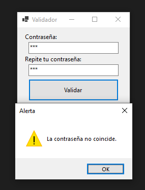
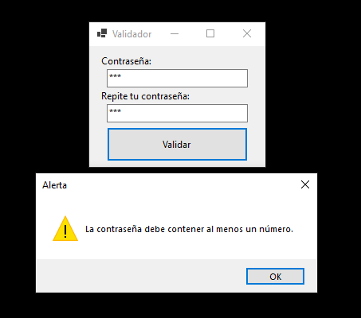

# Validador de Contraseñas
---
## Pantalla principal

## Campos Vacíos
Cuando uno o ambos campos están vacíos muestra el siguiente mensaje:
### Un campo vacío

### Ambos campos vacíos

## Contraseñas diferentes
En caso de que el texto en los campos sea diferente se muestra el siguiente mensaje:

## Revisión de la contraseña
Una vez que se confirmó que hay entradas iguales en ambos campos se procede a la verificación:
### Mayúscula
En caso de que la contraseña no tenga una mayúscula se muestra el siguiente mensaje:

### Minúscula
En caso de que la contraseña no tenga una minúscula se muestra el siguiente mensaje:

### Símbolo
En caso de que la contraseña no tenga un símbolo se muestra el siguiente mensaje:

### Número
En caso de que la contraseña no tenga un número se muestra el siguiente mensaje:

## La contraseña es válida
Si la contraseña es válida (cumple con todos los requisitos) entonces se muestra este mensaje:

